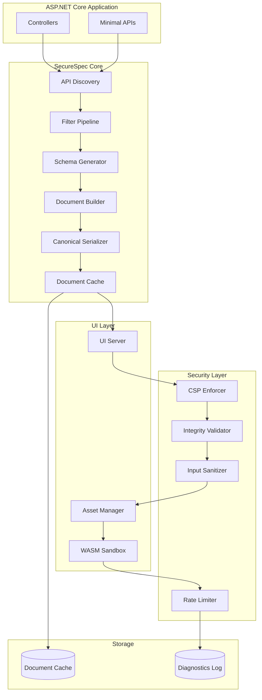
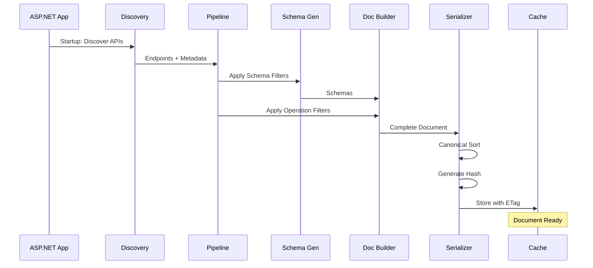
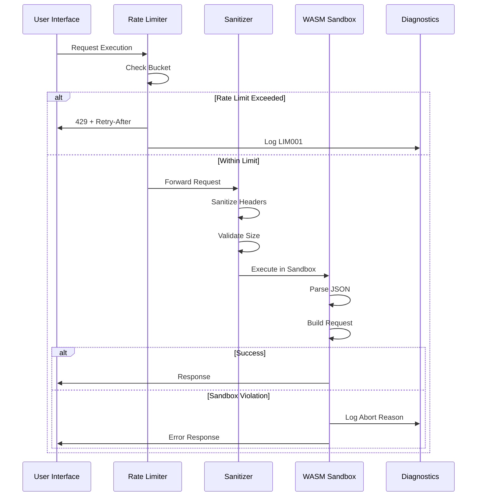

# Architecture

This document provides a comprehensive overview of the SecureSpec.AspNetCore architecture, design principles, and implementation patterns.

## Table of Contents

- [Overview](#overview)
- [High-Level Architecture](#high-level-architecture)
- [Core Components](#core-components)
- [Design Principles](#design-principles)
- [Data Flow](#data-flow)
- [Security Architecture](#security-architecture)
- [Performance Architecture](#performance-architecture)
- [Extensibility Points](#extensibility-points)

## Overview

SecureSpec.AspNetCore is architected as a security-hardened, deterministic OpenAPI documentation and exploration module. The architecture prioritizes:

1. **Security First**: Defense in depth with multiple layers of protection
2. **Determinism**: Reproducible builds with stable hashes
3. **Performance**: Efficient processing with resource guards
4. **Extensibility**: Well-defined extension points without compromising security
5. **Observability**: Comprehensive diagnostics and monitoring

## High-Level Architecture



## Core Components

### 1. API Discovery Engine

**Responsibility**: Discovers and catalogs ASP.NET Core endpoints

**Key Features**:
- Controller action discovery
- Minimal API endpoint discovery
- Attribute-based inclusion/exclusion
- Metadata extraction

**Implementation**:
```
ApiDiscoveryEngine
├── ControllerDiscovery
├── MinimalApiDiscovery
├── MetadataExtractor
└── FilterEvaluator
```

### 2. Schema Generator

**Responsibility**: Generates OpenAPI schemas from CLR types

**Key Features**:
- CLR type mapping (see docs/PRD.md Section 15)
- Nullability resolution (NRT support)
- DataAnnotations integration
- Polymorphism handling (AllOf/OneOf)
- Recursion detection

**Implementation**:
```
SchemaGenerator
├── TypeMapper
├── NullabilityResolver
├── DataAnnotationsMapper
├── PolymorphismHandler
├── RecursionDetector
└── SchemaIdGenerator (with collision handling)
```

### 3. Document Builder

**Responsibility**: Constructs complete OpenAPI documents

**Key Features**:
- Multi-document support
- Component registry
- Path and operation aggregation
- Security scheme integration

**Implementation**:
```
DocumentBuilder
├── DocumentRegistry
├── ComponentBuilder
├── PathBuilder
├── OperationBuilder
└── SecurityBuilder
```

### 4. Canonical Serializer

**Responsibility**: Produces deterministic JSON/YAML output

**Key Features**:
- Deterministic ordering (lexical)
- Stable hash generation (SHA256)
- ETag generation
- Format support (JSON, YAML)

**Implementation**:
```
CanonicalSerializer
├── JsonSerializer (deterministic)
├── YamlSerializer (deterministic)
├── HashGenerator
└── ETagGenerator
```

### 5. Filter Pipeline

**Responsibility**: Extensibility through ordered filter execution

**Execution Order**:
1. Schema Filters
2. Operation Filters
3. Parameter Filters
4. RequestBody Filters
5. Document Filters
6. PreSerialize Filters (mutation stage)

**Implementation**:
```
FilterPipeline
├── SchemaFilterExecutor
├── OperationFilterExecutor
├── ParameterFilterExecutor
├── RequestBodyFilterExecutor
├── DocumentFilterExecutor
└── PreSerializeFilterExecutor
```

### 6. Security Layer

**Components**:

#### Content Security Policy (CSP)
- Nonce generation per request
- Strict policy enforcement
- No unsafe-eval or unsafe-inline (except controlled styles)

#### Integrity Validator
- SHA256 hash verification
- Subresource Integrity (SRI)
- Optional cryptographic signatures
- Fail-closed on mismatch

#### Input Sanitizer
- Unicode normalization (NFC)
- CRLF injection prevention
- Header value sanitization
- Size limits enforcement

#### Rate Limiter
- Separate buckets: TryItOut, OAuth, SpecDownload
- Sliding window algorithm
- Atomic counters
- Retry-After headers

### 7. WASM Sandbox

**Responsibility**: Isolated request execution environment

**Key Features**:
- No network or DOM access
- Memory limits (fixed pages)
- CPU timeout enforcement
- Abort reason codes

**Isolation Boundaries**:
```
WASM Sandbox
├── Memory Boundary (fixed allocation)
├── CPU Boundary (timeout watchdog)
├── API Boundary (allowed: JSON parsing, UTF-8 encoding)
└── Network Boundary (hard deny)
```

### 8. Document Cache

**Responsibility**: Thread-safe caching with integrity

**Key Features**:
- RW lock (multiple readers, single writer)
- Integrity revalidation post-expiry
- Cache-Control headers
- Invalidation on schema change

**Implementation**:
```
DocumentCache
├── ReadWriteLock
├── CacheEntry (document + hash + timestamp)
├── IntegrityValidator
└── EvictionPolicy
```

### 9. Diagnostics System

**Responsibility**: Structured logging and monitoring

**Key Features**:
- Bounded retention (size + age)
- Atomic FIFO purge
- Structured events
- Diagnostic codes (SEC001, CSP001, etc.)

**Event Schema**:
```json
{
  "timestamp": "ISO 8601",
  "level": "Info|Warn|Error|Critical",
  "code": "ERROR_CODE",
  "message": "string",
  "context": { },
  "sanitized": boolean
}
```

## Design Principles

### 1. Security by Design

- **Defense in Depth**: Multiple security layers
- **Fail Closed**: Security failures stop processing
- **Least Privilege**: Minimal permissions required
- **Input Validation**: All inputs sanitized
- **Output Encoding**: All outputs encoded

### 2. Determinism

- **Reproducible Builds**: Same input → same output
- **Stable Hashes**: Canonical serialization
- **Predictable Ordering**: Lexical sorting
- **No Randomness**: Except cryptographic nonces

### 3. Performance

- **Lazy Evaluation**: Compute on demand
- **Efficient Caching**: Thread-safe, invalidation-aware
- **Virtualization**: Handle large schemas
- **Resource Bounds**: Guards on size, time, depth

### 4. Observability

- **Structured Logging**: Machine-readable diagnostics
- **Metrics Collection**: Performance and security metrics
- **Audit Trail**: Complete event history
- **Error Codes**: Unique codes for all failures

### 5. Extensibility

- **Filter Pipeline**: Ordered, non-destructive
- **Type Mappings**: Custom type handlers
- **Schema Customization**: SchemaId and collision strategies
- **Policy Hooks**: Authorization mapping

## Data Flow

### Document Generation Flow



### Request Execution Flow (Try It Out)



## Security Architecture

### Threat Model (STRIDE)

See [docs/THREAT_MODEL.md](docs/THREAT_MODEL.md) for complete threat analysis.

**Key Mitigations**:

| Threat | Mitigation | Component |
|--------|-----------|-----------|
| Spoofing | CSRF tokens, rotation | Security Layer |
| Tampering | SHA256 + SRI | Integrity Validator |
| Repudiation | Structured diagnostics | Diagnostics System |
| Information Disclosure | Sanitization, redaction | Input Sanitizer |
| Denial of Service | Rate limits, resource guards | Rate Limiter, Guards |
| Elevation of Privilege | CSP, sandbox isolation | CSP, WASM Sandbox |

### Security Zones

```
┌─────────────────────────────────────────────────────┐
│ Public Zone (Untrusted)                             │
│  - User Input                                       │
│  - HTTP Requests                                    │
└────────────┬────────────────────────────────────────┘
             │
             ▼
┌─────────────────────────────────────────────────────┐
│ Sanitization Zone                                   │
│  - Input Sanitizer                                  │
│  - Size Limits                                      │
│  - Unicode Normalization                            │
└────────────┬────────────────────────────────────────┘
             │
             ▼
┌─────────────────────────────────────────────────────┐
│ Processing Zone (Trusted)                           │
│  - Document Generation                              │
│  - Schema Processing                                │
│  - Filter Pipeline                                  │
└────────────┬────────────────────────────────────────┘
             │
             ▼
┌─────────────────────────────────────────────────────┐
│ Execution Zone (Isolated)                           │
│  - WASM Sandbox                                     │
│  - No Network/DOM                                   │
│  - Resource Limits                                  │
└────────────┬────────────────────────────────────────┘
             │
             ▼
┌─────────────────────────────────────────────────────┐
│ Output Zone (Protected)                             │
│  - CSP Headers                                      │
│  - Integrity Hashes                                 │
│  - Cache-Control                                    │
└─────────────────────────────────────────────────────┘
```

## Performance Architecture

### Caching Strategy

**Three-Level Cache**:

1. **Document Cache** (L1)
   - In-memory, thread-safe
   - RW lock for concurrency
   - Invalidation on change

2. **Schema Cache** (L2)
   - Type-to-schema mapping
   - Immutable after startup
   - Shared across documents

3. **HTTP Cache** (L3)
   - ETag-based validation
   - Cache-Control headers
   - Browser/CDN caching

### Virtualization

**Large Data Handling**:

- **Schemas**: >200 properties → virtualization
- **Enums**: >10K values → virtualization + search
- **Operations**: Performance targets per count
- **Examples**: Throttling (25ms budget)

### Resource Guards

**Enforcement Points**:

```
Request → Size Guard → Time Guard → Depth Guard → Processing
           ↓             ↓             ↓
        Max 25MB     Max 2000ms    Max 32 levels
```

## Extensibility Points

### 1. Filter Pipeline

**Extension Mechanism**: Implement filter interfaces

```csharp
public interface ISchemaFilter
{
    void Apply(OpenApiSchema schema, SchemaFilterContext context);
}
```

**Execution Guarantee**: Ordered, isolated context

### 2. Type Mappings

**Extension Mechanism**: Register custom mappings

```csharp
cfg.Schema.TypeMappings.Map<CustomType>(m => {
    m.Type = "string";
    m.Format = "custom";
});
```

### 3. Schema ID Strategy

**Extension Mechanism**: Custom naming function

```csharp
cfg.Schema.IdStrategy = type => $"Custom_{type.Name}";
```

### 4. Policy/Role Mapping

**Extension Mechanism**: Authorization scope mapping

```csharp
cfg.Security.PolicyToScope = policy => $"policy:{policy}";
cfg.Security.RoleToScope = role => $"role:{role}";
```

## Technology Stack

**Runtime**:
- .NET 8.0+
- ASP.NET Core

**OpenAPI**:
- OpenAPI 3.0 / 3.1 specification
- JSON Schema draft-07 / 2020-12

**Security**:
- WASM for sandboxing
- CSP Level 3
- SHA256 for integrity

**Serialization**:
- System.Text.Json (deterministic mode)
- YamlDotNet (canonical mode)

## Deployment Architecture

See [docs/DEPLOYMENT.md](docs/DEPLOYMENT.md) for deployment patterns and infrastructure requirements.

## References

- [PRD.md](docs/PRD.md) - Product Requirements (500 AC)
- [THREAT_MODEL.md](docs/THREAT_MODEL.md) - Security threat analysis
- [DESIGN.md](docs/DESIGN.md) - Design decisions
- [API_DESIGN.md](docs/API_DESIGN.md) - API design guidelines
- [TESTING_STRATEGY.md](docs/TESTING_STRATEGY.md) - Testing approach

---

**Last Updated**: 2025-10-19  
**Version**: 1.0  
**Status**: Pre-Implementation
