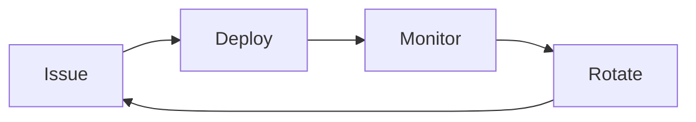

# Mutual TLS Authentication Guide

## Overview

Mutual TLS (mTLS) is a security mechanism that requires both the client and server to authenticate each other using digital certificates. This provides strong authentication for API communication, particularly useful for:

- Service-to-service authentication in microservices architectures
- API gateway to backend service communication
- High-security environments requiring certificate-based authentication

## Important Limitations

### Display Only

⚠️ **This library provides display-only support for Mutual TLS in OpenAPI documentation.**

What this means:
- The Mutual TLS security scheme will appear in your OpenAPI/Swagger documentation
- API consumers can see that Mutual TLS authentication is required
- **No certificate upload functionality is provided**
- **No certificate processing or storage capabilities**

### Certificate Management is External

All certificate management must be handled externally at the infrastructure level:
- **API Gateway** (e.g., Azure API Management, AWS API Gateway, Kong)
- **Load Balancer** (e.g., Azure Application Gateway, AWS ALB/NLB, F5)
- **Web Server** (e.g., Nginx, IIS, Apache)
- **Reverse Proxy** (e.g., Envoy, Traefik, HAProxy)

## Configuration

### Basic Setup

```csharp
builder.Services.AddSecureSpec(options =>
{
    options.Security.AddMutualTls("mutualTLS");
});
```

### With Custom Description

```csharp
builder.Services.AddSecureSpec(options =>
{
    options.Security.AddMutualTls("mutualTLS", builder => builder
        .WithDescription("Mutual TLS authentication. Client certificates must be issued by the corporate CA and configured at the API Gateway."));
});
```

### Multiple Mutual TLS Schemes

You can define multiple Mutual TLS schemes for different purposes:

```csharp
builder.Services.AddSecureSpec(options =>
{
    // For external client authentication
    options.Security.AddMutualTls("clientAuth", builder => builder
        .WithDescription("Client certificate authentication for external consumers"));

    // For internal service-to-service communication
    options.Security.AddMutualTls("serviceAuth", builder => builder
        .WithDescription("Service-to-service authentication using internal CA"));
});
```

### Mixed Authentication Schemes

Combine Mutual TLS with other authentication methods:

```csharp
builder.Services.AddSecureSpec(options =>
{
    // HTTP Bearer for user authentication
    options.Security.AddHttpBearer("userAuth", builder => builder
        .WithBearerFormat("JWT")
        .WithDescription("User authentication with JWT tokens"));

    // Mutual TLS for service-to-service
    options.Security.AddMutualTls("serviceAuth", builder => builder
        .WithDescription("Service-to-service authentication"));
});
```

## OpenAPI Output

The Mutual TLS scheme appears in your OpenAPI document like this:

```json
{
  "components": {
    "securitySchemes": {
      "mutualTLS": {
        "type": "openIdConnect",
        "description": "Mutual TLS authentication. Client certificates must be configured externally at the TLS layer. Certificate upload is not supported; certificates are managed through infrastructure configuration.",
        "x-security-scheme-type": "mutualTLS"
      }
    }
  }
}
```

### Why `type: openIdConnect`?

The current version of Microsoft.OpenApi (1.6.22) does not support the `mutualTLS` SecuritySchemeType from OpenAPI 3.1. As a workaround:
- We use `openIdConnect` as a placeholder type
- The vendor extension `x-security-scheme-type` indicates the true type is `mutualTLS`
- When the library adds native support, the implementation will be updated

## Infrastructure Setup

### Common Deployment Patterns

#### 1. API Gateway Pattern

```
Internet → API Gateway (mTLS validation) → Backend API
```

Configure certificate validation at the API Gateway:
- Azure API Management: Configure client certificate validation policies
- AWS API Gateway: Enable mutual TLS authentication
- Kong: Use the `mtls-auth` plugin

#### 2. Load Balancer Pattern

```
Internet → Load Balancer (mTLS validation) → Backend Servers
```

Configure certificate validation at the load balancer:
- Azure Application Gateway: Configure client authentication settings
- AWS ALB: Enable mutual authentication with trusted CA bundle
- NGINX: Configure `ssl_client_certificate` and `ssl_verify_client`

#### 3. Sidecar Proxy Pattern

```
Service A → Envoy Sidecar → Envoy Sidecar → Service B
```

Common in service mesh architectures (Istio, Linkerd):
- Automatic mTLS between services
- Certificate rotation handled by the mesh
- Zero application code changes

## Certificate Management Best Practices

### 1. Certificate Authority (CA)

- **Internal CA**: Use for internal service-to-service communication
- **Public CA**: May be required for external clients
- **Private PKI**: Recommended for large enterprises

### 2. Certificate Lifecycle



**Issue**: Generate certificates with appropriate validity periods (typically 1-2 years)

**Deploy**: Securely distribute certificates to clients and configure infrastructure

**Monitor**: Track certificate expiration dates and set up alerts

**Rotate**: Replace certificates before expiration (recommend 30-60 days before)

### 3. Security Considerations

✅ **DO**:
- Use strong key lengths (minimum 2048-bit RSA or 256-bit ECC)
- Implement certificate revocation checking (CRL or OCSP)
- Monitor certificate expiration and failed authentication attempts
- Use separate certificates for different environments (dev, staging, production)
- Validate certificate subject/SAN matches expected identity

❌ **DON'T**:
- Store private keys in application code or source control
- Use self-signed certificates in production
- Ignore certificate validation errors
- Share certificates across multiple clients/services (unless intentional)

### 4. Automation

Automate certificate management where possible:
- **cert-manager**: Kubernetes native certificate management
- **Let's Encrypt**: Free automated certificate issuance (for public CAs)
- **HashiCorp Vault**: PKI secrets engine for internal CAs
- **AWS Certificate Manager**: Managed certificates for AWS services
- **Azure Key Vault**: Managed certificates for Azure services

## Testing

### Development/Testing Environments

For testing purposes, you can use self-signed certificates:

```bash
# Generate a self-signed certificate
openssl req -x509 -newkey rsa:4096 -keyout key.pem -out cert.pem -days 365 -nodes
```

Configure your infrastructure to accept the test certificate, but **never use self-signed certificates in production**.

### Verification

Test your Mutual TLS configuration:

```bash
# Test with curl
curl --cert client.pem --key client-key.pem https://api.example.com/endpoint

# Test certificate validation
openssl s_client -connect api.example.com:443 -cert client.pem -key client-key.pem -showcerts
```

## Troubleshooting

### Common Issues

**Issue**: "Certificate not trusted"
- **Cause**: Client certificate not issued by trusted CA
- **Solution**: Ensure the CA certificate is in the trust store

**Issue**: "Certificate verification failed"
- **Cause**: Certificate expired, revoked, or subject mismatch
- **Solution**: Check certificate validity and subject/SAN fields

**Issue**: "No client certificate provided"
- **Cause**: Client not configured to send certificate
- **Solution**: Verify client configuration and certificate accessibility

**Issue**: "TLS handshake failure"
- **Cause**: TLS version mismatch or cipher suite incompatibility
- **Solution**: Ensure compatible TLS versions (recommend TLS 1.2+)

## Example Infrastructure Configurations

### NGINX

```nginx
server {
    listen 443 ssl;
    server_name api.example.com;

    ssl_certificate /path/to/server-cert.pem;
    ssl_certificate_key /path/to/server-key.pem;

    # Enable client certificate verification
    ssl_client_certificate /path/to/ca-cert.pem;
    ssl_verify_client on;
    ssl_verify_depth 2;

    location / {
        proxy_pass http://backend;
        # Pass client certificate info to backend
        proxy_set_header X-Client-Cert $ssl_client_cert;
        proxy_set_header X-Client-Verify $ssl_client_verify;
    }
}
```

### Azure API Management

```xml
<policies>
    <inbound>
        <authentication-certificate thumbprint="certificate-thumbprint" />
        <choose>
            <when condition="@(context.Request.Certificate == null)">
                <return-response>
                    <set-status code="403" reason="Certificate Required" />
                </return-response>
            </when>
        </choose>
    </inbound>
</policies>
```

### Envoy (Service Mesh)

```yaml
tls_context:
  common_tls_context:
    tls_certificates:
      - certificate_chain: { filename: "/etc/certs/cert-chain.pem" }
        private_key: { filename: "/etc/certs/key.pem" }
    validation_context:
      trusted_ca: { filename: "/etc/certs/ca-cert.pem" }
  require_client_certificate: true
```

## Documentation for API Consumers

When documenting your API for consumers, include:

1. **Certificate Acquisition**: How to obtain client certificates
   - Contact information for certificate requests
   - Required certificate attributes (subject, SAN, etc.)
   - Supported CAs

2. **Certificate Installation**: Platform-specific instructions
   - Windows: Import into Personal certificate store
   - macOS: Import into Keychain
   - Linux: Add to certificate directory
   - Code: Language-specific examples

3. **Testing Guidance**: How to verify certificate setup
   - Provide test endpoints
   - Share test certificates (for non-production)
   - Include curl/Postman examples

## References

- [OpenAPI 3.1 Security Schemes](https://spec.openapis.org/oas/v3.1.0#security-scheme-object)
- [RFC 8446: TLS 1.3](https://tools.ietf.org/html/rfc8446)
- [RFC 5280: X.509 Certificate Profile](https://tools.ietf.org/html/rfc5280)
- [OWASP Transport Layer Protection Cheat Sheet](https://cheatsheetseries.owasp.org/cheatsheets/Transport_Layer_Protection_Cheat_Sheet.html)

## Support

For issues or questions about Mutual TLS implementation in SecureSpec.AspNetCore:
- Open an issue on GitHub
- Check the [Security README](../src/SecureSpec.AspNetCore/Security/README.md) for technical details
- Review the [PRD](PRD.md) for acceptance criteria
