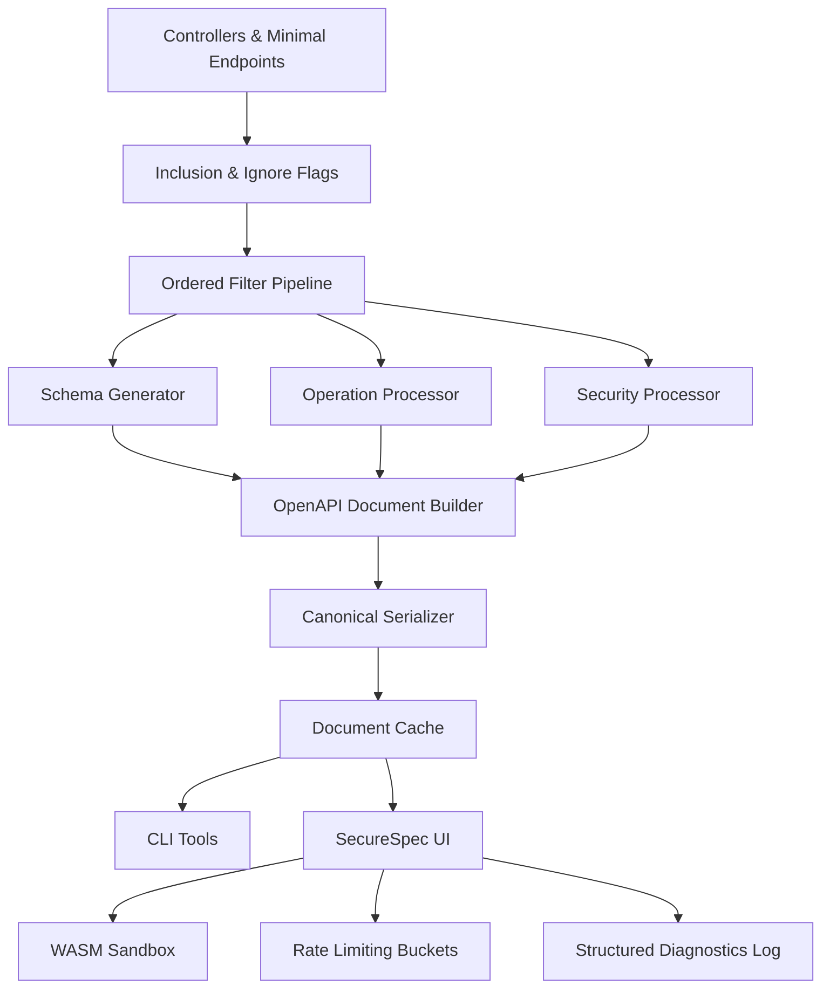

# SecureSpec.AspNetCore API Documentation & Interactive Exploration Module
## Version: Final (Engineering Hand‑Off)
## Date: 2025-10-19
## Baseline Parity Target: Swashbuckle.AspNetCore 6.5.0 (SwaggerGen + Swagger UI Core)
## Status: READY FOR IMPLEMENTATION & AUDIT

---

## 0. Executive Summary

SecureSpec.AspNetCore is a security‑hardened, deterministic, fully auditable OpenAPI 3.0 / 3.1 documentation and exploration module replacing Swashbuckle.AspNetCore + Swagger UI. It delivers explicit IMPLEMENT / OPTIONAL / DEFERRED / OMIT‑SECURE classifications, comprehensive Acceptance Criteria (AC), reproducible build output (stable hashes across JSON/YAML), sandboxed interactive execution, strict sanitization, integrity enforcement (SHA256 + SRI + signature), rate limiting, thread‑safe caching, and detailed diagnostics with bounded retention.

### 0.1 Quick Start Guide for Engineers
- **Primary Goal**: Secure, deterministic parity replacement for Swashbuckle.AspNetCore.
- **Key Differentiators**: Canonical serialization, WASM sandbox isolation, integrity gating, exhaustive audit trail (AC 1–500).
- **Implementation Priority**:
  1. Core OpenAPI generation & schema fidelity (AC 1–140, 401–430)
  2. Security schemes & OAuth flows + mutation (AC 189–220, 431–445)
  3. UI & Interaction (AC 331–366, 446–465)
  4. Performance / resource guards / virtualization (AC 297–330, 466–480)
  5. Diagnostics, concurrency, omissions enforcement (AC 379–400, 481–500)

---

## 1. Goals (Paraphrased)
| # | Goal | Outcome |
|---|------|---------|
| 1 | Deterministic multi‑document OpenAPI | JSON/YAML canonical hashes, stable ETag |
| 2 | Schema fidelity (NRT + DataAnnotations + CLR primitives) | Accurate types/formats, nullability, constraints |
| 3 | Polymorphism parity | AllOf / OneOf / Automatic / Flatten (non‑destructive) |
| 4 | Example precedence parity | Named > Single/Attribute > Component > Generated > Blocked |
| 5 | Full media & parameter execution | JSON/XML/text/plain/multipart/form/binary |
| 6 | Styles fidelity | matrix/label/form/simple/pipeDelimited/spaceDelimited/deepObject |
| 7 | Security semantics | AND inside requirement, OR across objects, per‑operation override |
| 8 | Filter pipeline ordering | Schema→Operation→Parameter→RequestBody→Document→PreSerialize |
| 9 | Multi‑file XML ingestion | Ordered merge + conflict diagnostics |
|10 | Server variable substitution | Safe edit + revert invalid, isolation |
|11 | Extensibility hooks | OperationId + SchemaId + MapType<T> + Policy/Role mappings |
|12 | Vendor extension safety | Sanitization + truncation + lexical ordering |
|13 | Integrity & CSP | SHA256 + SRI + signature + strict CSP policy |
|14 | Virtualization & guards | Large sets performance, example synthesis throttling |
|15 | Rate limiting buckets | TryItOut / OAuth / Spec Download with atomic counters |
|16 | Asset caching | Cache-Control + post-expiry integrity revalidation |
|17 | Sanitization ordering | Headers/server variables normalized pre-mutation |
|18 | Diagnostics retention | Size & age purge atomic FIFO |
|19 | Thread safety & concurrency | Locking strategy for document cache & filters |
|20 | Accessibility | WCAG 2.1 AA (ARIA, focus, skip links, modals) |
|21 | Complete audit coverage | Acceptance Criteria 1–500 |

---

## 2. Supported Authentication & Security Schemes

### OAuth Flows (IMPLEMENT)
| Flow | PKCE | Notes |
|------|------|-------|
| Authorization Code | REQUIRED | Auto code challenge/verifier |
| Client Credentials | N/A | Scoped client authentication |

### Schemes (IMPLEMENT)
| Scheme | Location | Notes |
|--------|----------|-------|
| HTTP Bearer | Header | No Basic inference |
| API Key (header) | Header | Sanitized custom name |
| API Key (query) | Query | Sanitized param |
| Mutual TLS | TLS | Display only; no cert upload |

**OMIT‑SECURE**: Implicit/Password flows, Basic inference.

---

## 3. Secure Omissions (Non‑Goals)
(UNCHANGED rationale—explicit list maintained: Swagger 2.0 output, implicit/password OAuth, PersistAuthorization, remote validatorUrl, raw JS plugins, layout switching, path-level `$ref`, remote examples `$ref`, patternProperties enforcement, cross-variable server constraints, advanced polymorphism diff UI, nested multi-dimensional file arrays, models panel search, automatic camelCase renaming, Basic auth inference, withCredentials cross-origin, advanced XML attributes, multi-document diff/version comparison, webhooks rendering, initial model rendering toggle, role auto mapping, per-document route templates, full index HTML override, custom document serializer override, ReDoc embedding, per-document divergent UI options.)

---

## 4. System Architecture


---

## 5. Performance Targets
| Operation | Target | Degraded | Failure |
|-----------|--------|----------|---------|
| Generation (1000 ops) | <500ms | 500–2000ms | >2000ms |
| Recursive schema traversal | <100ms | 100–500ms | >500ms |
| Enum search (10K) | <50ms | 50–200ms | >200ms |
| Initial UI load (cached) | <1s | 1–3s | >3s |
| Hash computation | <50ms | 50–200ms | >200ms |

---

## 6. Migration Mapping
| Swashbuckle | SecureSpec |
|-------------|-----------|
| SwaggerDoc | Documents.Add |
| AddSecurityDefinition | SecuritySchemes.Add |
| OperationFilter<T> | Filters.Operation.Add<T> |
| SchemaFilter<T> | Filters.Schema.Add<T> |
| DocumentFilter<T> | Filters.Document.Add<T> |
| PreSerializeFilters.Add | Filters.PreSerialize.Add |
| MapType<T> | Schema.TypeMappings.Map<T> |
| CustomSchemaIds | Schema.IdStrategy + collision suffix |
| CustomOperationIds | OperationIds.Strategy |

**Breaking Changes**: No automatic camelCase; no remote `$ref`; Basic inference removed; full index HTML override removed; ReDoc omitted.

---

## 7. Threat Model (STRIDE)
| Threat | Mitigation | AC |
|--------|------------|----|
| Spoofing | CSRF double-submit & rotation | 199–200 |
| Tampering | SHA256 + SRI + signature fail-close | 19–21, 304–306 |
| Repudiation | Structured diagnostics + retention | 381–400 |
| Information Disclosure | Sanitization, redaction, restricted head | 31–32, 275–277 |
| DoS | Rate limits + virtualization + size/time guards | 301–303, 319–330 |
| Elevation of Privilege | CSP strict + sandbox isolation | 209–213, 436 |
| Injection | CRLF strip, Unicode normalization, sanitized head/CSS | 238–241, 435 |
| Logic Abuse | PreSerialize boundary enforcement | 400, 433 |

---

## 8. Implementation Phases
| Phase | Weeks | Focus | AC Span |
|-------|-------|-------|---------|
| 1 | 1–2 | Core docs & schema | 1–140, 401–416 |
| 2 | 3–4 | Security flows & mutation | 189–220, 431–443 |
| 3 | 5–6 | UI & filters | 331–366, 446–458 |
| 4 | 7 | Performance & guards | 297–330, 459–472 |
| 5 | 8 | Diagnostics & retention | 379–400, 481–490 |
| 6 | 9 | Accessibility & CSP | 325–360, 473–480, 491–500 |

---

## 9. Monitoring & Observability
| Metric | Collection | Alert Threshold |
|--------|------------|-----------------|
| Gen latency p95 | Instrumented timer | >2s (page) |
| Integrity failures | Count | >0 (page) |
| Rate limit violations | Counter per bucket | >100/min (warn) |
| Sandbox memory | Gauge | >80% (warn) |
| Diagnostics purge frequency | Counter | Unexpected spikes (investigate) |
| Enum search latency p95 | Timer | >200ms (warn) |

---

## 10. Testing Strategy
| Category | Unit | Integration | E2E | Perf |
|----------|------|-------------|-----|------|
| Generation | 95% | 90% | 85% | ✓ |
| Security | 100% | 95% | 90% | ✓ |
| UI | 85% | 85% | 90% | ✓ |
| Rate Limiting | 90% | 95% | 85% | ✓ |
| Virtualization | 90% | 90% | 85% | ✓ |
| Accessibility | 80% | 80% | 90% | ✓ |

---

## 11. Configuration Schema (Conceptual)
```typescript
interface SecureSpecConfig {
  documents: DocumentConfig[];
  security: SecurityConfig;
  ui: UIConfig;
  performance: PerformanceConfig;
  diagnostics: DiagnosticsConfig;
  rateLimiting: RateLimitConfig;
  cache: CacheConfig;
  schema: SchemaConfig;
  filters: FilterConfig;
  sandbox: SandboxConfig;
}

interface SchemaConfig {
  useNrt: boolean;
  idStrategy: (clrType: Type) => string;
  idCollisionSuffixPattern: string; // e.g. "_schemaDup{N}"
  maxGraphDepth: number; // e.g. 32
  enumInlining: boolean;
  typeMappings: Record<string, CustomTypeMapping>;
  enumNamingPolicy?: (name: string) => string;
}
```

---

## 12. Error Code Reference
| Code | Description | Severity | Action |
|------|-------------|----------|--------|
| SEC001 | Integrity check failed | Critical | Abort load |
| CSP001 | CSP mismatch or missing directives | Error | Review policy |
| SCH001 | SchemaId collision suffix applied | Info | Confirm stability |
| ANN001 | DataAnnotations conflict (last wins) | Warn | Harmonize constraints |
| LIM001 | Rate limit bucket enforced | Info | Evaluate thresholds |
| LIM002 | Rate limit reset anomaly | Warn | Check time source |
| MAP001 | MapType override applied | Info | Validate mapping correctness |
| NRT001 | Nullability mismatch | Error | Adjust NRT config |
| EXM001 | Example generation throttled | Warn | Provide explicit example |
| VIRT001 | Virtualization threshold triggered | Info | Performance expectation |
| RET001 | Retention size purge executed | Info | Monitor volume |
| RET002 | Retention age purge executed | Info | Confirm retentionDays |
| HD001 | Disallowed head injection attempt | Warn | Use local meta/link |
| AUTH001 | Basic auth inference blocked | Warn | Define explicitly |
| POL001 | PolicyToScope mapping applied | Info | Validate scopes |
| ROLE001 | RoleToScope mapping applied | Info | Validate scopes |

---

## 13. Accessibility Requirements
| Requirement | Target |
|-------------|--------|
| WCAG 2.1 Level AA | Compliant |
| Skip link | Present & focusable |
| Keyboard navigation | All interactive elements |
| aria-expanded sync | Accurate on collapsibles |
| Modal focus trap | Enforced & escape closes |
| Contrast ratios | ≥4.5:1 normal text |
| Screen reader announcements | Live region for dynamic updates |

---

## 14. Compatibility Matrix
| Swashbuckle Version | Compatibility | Notes |
|---------------------|--------------|-------|
| 6.5.0 | Full | Baseline target |
| 6.0–6.4.x | High | Minor differences |
| 5.x | Partial | Requires migration; OpenAPI 3.x only |

---

## 15. Built‑In CLR Type → OpenAPI Mapping (Parity)
| CLR Type | OpenAPI Type | Format | Notes |
|----------|--------------|--------|------|
| string | string |  | UTF-8 |
| Guid | string | uuid | Lowercase canonical |
| DateTime | string | date-time | RFC 3339 |
| DateTimeOffset | string | date-time | Offset preserved |
| DateOnly | string | date | ISO 8601 |
| TimeOnly | string | time | HH:MM:SS(.fff) |
| bool | boolean |  |  |
| byte | integer | int32 | Minimum 0 |
| sbyte | integer | int32 | Signed |
| short | integer | int32 | Signed |
| ushort | integer | int32 | Unsigned |
| int | integer | int32 | Signed |
| uint | integer | int64 | Represented to avoid overflow |
| long | integer | int64 | Signed |
| ulong | integer | int64 | May exceed max; documented |
| float | number | float | IEEE 754 |
| double | number | double | IEEE 754 |
| decimal | number |  | High precision (string fallback if overflow) |
| byte[] | string | byte | Base64url (RFC 4648) |
| IFormFile | string | binary | Content-type preserved |
| Dictionary<K,V> (K=string) | object |  | additionalProperties schema of V |
| Nullable<T> (value types) | same + `nullable:true` (3.0) / union type (3.1) |  | Null union `[type,"null"]` in 3.1 |
| Enum (string) | string |  | Values lexical or custom policy |
| Enum (int) | integer | int32 | Unless forced string mode |

---

## 16. Nullability Semantics
- OpenAPI 3.0: `nullable: true` for reference/value wrappers.
- OpenAPI 3.1: union types (e.g. `type: [ "string", "null" ]`).
- Arrays: nullable array vs nullable items distinguished.
- Dictionaries: nullable value schema preserved.
- OneOf discriminated sets: nullable variant addition documented when present.

---

## 17. SchemaId Strategy & Collision Handling
- Default pattern: `Namespace.TypeName` with generic expansion `TypeNameOfNestedTypeAndAnother` or `PagedResult«User»` (configurable).
- Generics canonical order by declaration.
- Collision suffix: `_schemaDup{N}` deterministic lexical increment.
- Stability: same input set yields identical SchemaIds & suffix numbering across rebuilds.

---

## 18. Cycle Detection & Depth Limits
- Max traversal depth: 32 (configurable).
- Cycle detection uses visited identity set; first revisit produces placeholder `<recursive…>` and halts descent.
- Ordering of emitted `$ref` components lexical by SchemaId.

---

## 19. Dictionary Handling
- `Dictionary<string,T>` ⇒ `type: object`, `additionalProperties` = schema(T).
- Value constraints (e.g. `[Range]`, `[MinLength]` on value type) applied inside `additionalProperties`.
- Conflicts between value DataAnnotations & explicit override produce `dataAnnotationConflict`.

---

## 20. Enum Strategy
- Declaration order preserved unless custom naming policy provided.
- Option: integer or string representation (config `enumRepresentation = "string" | "integer"`).
- >10K enum values triggers virtualization + `VIRT001` diagnostic; search still functional.
- Nullability: 3.1 union includes `"null"`, 3.0 uses `nullable:true`.

---

## 21. Discriminator & Polymorphism Details
- Discriminator property emitted when configured or AllOf/OneOf with known base.
- If missing mapping for a variant: badge + `Discriminator mapping missing` diagnostic.
- Variant ordering lexical by discriminator key or SchemaId.
- Reserved keyword collisions (e.g., `default`, `type`) escaped via `_` prefix (configurable).

---

## 22. Media Type & Content Negotiation
- Deterministic media type ordering: `application/json` → `application/xml` → `text/plain` → others lexically → `multipart/form-data` → `application/octet-stream`.
- Shared schema reuse across media types uses single `$ref`.
- Multipart validator: field count limit (default 100) + total size limit; exceeding triggers blocked request + diagnostic.
- Binary size threshold enforced pre-dispatch.

---

## 23. Filter Interaction Ordering
- Schema filters run before Operation filters; Parameter filters after Operation; RequestBody filters after Parameter; Document filters after RequestBody; PreSerialize last.
- Schema filter modifications propagate to RequestBody/Parameter filters (verified AC).
- Structural schema mutation forbidden post PreSerialize (only servers/security mutated).

---

## 24. Per‑Operation Security Overrides
- Operation-level security array overrides global when present (no merge).
- Order deterministic (insertion order → lexical fallback).
- Empty array explicitly clears global security requirements.

---

## 25. Deep Linking & OperationId Display
- IMPLEMENT: deepLinking anchors always present; when enabled, auto-scroll on hash navigation; disabled suppresses scroll only.
- displayOperationId: hides text label while retaining stable anchor identifiers.

---

## 26. SupportedSubmitMethods / Method Whitelisting
- Whitelist configured; unsupported methods (TRACE, CONNECT) non-executable (badges).
- Changing whitelist persists across page reload (local ephemeral state invalidated on hash mismatch).

---

## 27. UI model expansion depths
- defaultModelsExpandDepth: initial models tree depth; -1 hides entire section.
- defaultModelExpandDepth: nested property expansion limit; beyond shows collapsible placeholder node.

---

## 28. Search / Filter Box Behavior
- Sanitizes control characters and Unicode normalization (NFC).
- Case-sensitive substring semantics under compatibility mode.
- Debounce interval default 150ms (configurable).
- Memory cap for filter results prevents large in-memory array duplication (virtualized listing).

---

## 29. Vendor Extension Limits & Ordering
- Max raw size before truncation: 5120 bytes.
- Allowed JSON token types: string, number, boolean, object, array (null coerced to string "null").
- Display ordering lexical by extension key.
- Expansion retains lexical ordering inside object (keys sorted).

---

## 30. Links & Callbacks Edge Cases
- Circular link detection logs diagnostic; second recursion replaced with placeholder.
- Missing `operationId` but present `operationRef` uses `operationRef`; if both missing, logs warning and renders minimal link stub.
- Callbacks read-only rendering; no request execution.

---

## 31. jsonSchemaDialect Value
- Explicit value: `https://spec.openapis.org/oas/3.1/dialect/base` (AC added).

---

## 32. Content Security Policy (CSP) Policy
```
Content-Security-Policy:
  default-src 'none';
  script-src 'nonce-{nonce}';
  style-src 'self' 'unsafe-inline';
  img-src 'self' data:;
  font-src 'self';
  connect-src 'self';
  frame-ancestors 'none';
  object-src 'none';
  base-uri 'self';
  form-action 'self';
```
- No `unsafe-eval`, no remote script origins beyond self with nonce.

---

## 33. Integrity & Signature Details
- Algorithm: SHA256 only (configurable future agility).
- Canonicalization: UTF-8, LF endings, no BOM, normalized whitespace, stable key ordering pre-hash.
- Mismatch emits SEC001 with redaction of path and only first 8 chars of expected hash.

---

## 34. Rate Limiting Semantics
- Sliding window counters with monotonic high-resolution clock.
- Atomic increment & read; lock-free or CAS semantics.
- `Retry-After` header returned with remaining seconds.
- Burst handling: peak shaping—excess bursts over limit drop instantly with diagnostic.

---

## 35. WASM Sandbox Surface
| Allowed | Notes |
|---------|------|
| JSON parsing | Bound memory use |
| UTF-8 encoding | Provided helper |
| Deterministic RNG | Seeded for test reproducibility |
| Limited time API | Monotonic time only |
| No network/DOM | Hard fail attempt logs diagnostic |
| Memory growth | Disabled; fixed pages |

Abort reason codes: MEMORY_CAP, CPU_TIMEOUT, API_VIOLATION.

---

## 36. CLI Exit Codes Mapping
| Code | Meaning |
|------|---------|
| 0 | Success |
| 1 | Structural validation failure |
| 2 | Size/time guard exceeded (fallback doc produced) |
| 3 | Configuration error (invalid config / mapping) |
| 4 | I/O failure (filesystem/permission) |
| 5 | Integrity/signature mismatch (optional extension) |

---

## 37. Diagnostics Retention & Purge Atomicity
- Size purge happens first, then age purge if both thresholds exceeded, preserving chronological order.
- Purge ordering deterministic by timestamp asc, then insertion index.

---

## 38. Thread Safety / Concurrency Guarantees
- Document cache guarded by RW lock (multiple readers, single writer).
- Filter lists immutable after startup; PreSerialize filters executed per request with isolated context, no shared mutable schema objects.
- Example synthesis throttling (EXM001) uses atomic counters; safe under concurrent request load.

---

## 39. Startup vs Runtime Mutation Boundaries
- Structural schema graph built once at startup.
- Runtime PreSerialize limited to servers array & security requirement list; attempts to mutate components/schemas logged & blocked.

---

## 40. AdditionalProperties vs Explicit Properties Conflict
- If `additionalProperties:false`, attempts to inject extension property in UI show rejection badge & diagnostic.
- If MapType introduces property conflicting with explicit property, conflict logged.

---

## 41. Fallback Document Behavior
- Trigger conditions: structural validation failure OR generation timeout OR memory guard.
- Fallback surface: Info + sanitized banner; no paths, operations, or security arrays.
- No stale operations leak; previous doc discarded rather than reused.

---

## 42. Large Schema Virtualization Criteria
- Threshold: >200 properties OR >50 nested object properties triggers virtualization (VIRT001).
- Placeholder token: `<virtualized…>` for truncated property groups.
- Expanded view loaded on demand (lazy rendering).

---

## 43. Deterministic Component Array Ordering
- Components (schemas, responses, parameters, securitySchemes, examples) sorted lexical ascending by key before serialization.

---

## 44. Error Code Completeness Guarantee
- Closed set enumerated; unknown diagnostic code triggers internal warning & AC failure (test harness assertion).

---

## 45. Numeric Serialization Locale Invariance
- All decimals use '.' period; grouping separators not emitted; tested under multiple cultures.

---

## 46. Max Recursion Depth Constant
- Default 32; exceeded path logs SCH001-DEPTH diagnostic along with placeholder insertion.

---

## 47. ETag Generation Algorithm
- Weak ETag format: `W/"sha256:<first16hex>"`; collision improbable but if occurs identical content confirmed; no suffix added (AC ensures hash parity).

---

## 48. Accessibility Enhancements
- Skip link to main content.
- `aria-expanded` synchronized on collapsible nodes.
- Modal focus trap & ESC key dismissal.
- Focus outline 2px, high contrast.

---

## 49. Header Sanitization Ordering
- Unicode normalization (NFC) → CR/LF removal → length truncation (>8KB) → diagnostic logging.

---

## 50. Multipart Boundary Field Count Limit
- Field count limit default 200 (names + files); exceeding triggers blocked request & diagnostic BND001.

---

## 51. Example Generation Throttling
- Time budget per example synthesis 25ms; exceeding produces EXM001 & truncates nested structure expansion.

---

## 52. CSP & SRI Interplay
- CSP nonce unrelated to integrity hash; deterministic SRI values—no double hashing or mismatch due to nonce.
- AC ensures CSP directives unchanged across rebuild.

---

## 53. Rate Limit Diagnostic Structure
```json
{
  "code": "rateLimitBucketEnforced",
  "bucket": "TryItOut",
  "remaining": 0,
  "windowSeconds": 60,
  "reason": "limit_exceeded"
}
```

---

## 54. Added / Updated Acceptance Criteria (New AC 401–500)
Below new criteria address previously missing parity confirmations without introducing scope creep.

### 54.1 SchemaId & Collision (AC 401–408)
401 SchemaId generic naming deterministic (same order across rebuilds)  
402 SchemaId collision applies `_schemaDup{N}` suffix starting at 1  
403 Collision suffix numbering stable across rebuilds given same type set  
404 SchemaId strategy override applied before collision detection  
405 Collision diagnostic SCH001 emitted per duplicate after first  
406 Generic nested types produce canonical `Outer«Inner»` form (configurable)  
407 Nullable generic arguments retain canonical ordering in SchemaId  
408 Removing a type reclaims suffix sequence deterministically on rebuild

### 54.2 CLR Primitive Mapping (AC 409–419)
409 Guid mapped to `type:string format:uuid`  
410 DateTime/DateTimeOffset mapped `type:string format:date-time` retaining offset  
411 DateOnly mapped `type:string format:date`  
412 TimeOnly mapped `type:string format:time` HH:MM:SS(.fff)  
413 byte[] mapped `type:string format:byte` (base64url)  
414 IFormFile mapped `type:string format:binary`  
415 Decimal serialized as `type:number` (no format)  
416 Nullable value types apply `nullable:true` (3.0) or union (3.1)  
417 Enum string mode preserves declaration order  
418 Integer enum mode uses `type:integer` with values ascending  
419 Enum naming policy override applied before emission

### 54.3 Nullability & 3.1 Representation (AC 420–426)
420 Reference type optional (no nullable) absent `nullable:true` in 3.0  
421 Reference type annotated nullable emits `nullable:true` (3.0) / union (3.1)  
422 Array nullable means array may be null (union in 3.1)  
423 Nullable items (e.g., `string?`) do not require array union; item schema marked nullable  
424 Dictionary value nullable represented inside `additionalProperties`  
425 OneOf variant nullable represented with separate variant or union type (3.1)  
426 Mixed nullable inside AllOf retains original union semantics (no flatten mutation)

### 54.4 Recursion & Depth (AC 427–431)
427 Max depth constant enforces cut-off at level 32  
428 Depth exceed logs SCH001-DEPTH diagnostic  
429 Cycle detection prevents infinite traversal (single placeholder insertion)  
430 Multiple cycles produce single placeholder per cycle root  
431 Depth change (config) recalculates schema traversal deterministically

### 54.5 Dictionaries & AdditionalProperties (AC 432–437)
432 Dictionary emits `additionalProperties` referencing value schema  
433 DataAnnotations on value type applied inside `additionalProperties` schema  
434 Conflict between explicit property and dictionary key logs ANN001  
435 Header/value Unicode normalized before constraint evaluation  
436 Ordering of dictionary value schema keys lexical  
437 additionalProperties:false blocks extension property injection attempts (diagnostic)

### 54.6 Enum Advanced Behavior (AC 438–443)
438 Enum declaration order stable across rebuilds  
439 Enum switching integer→string toggles representation without order drift  
440 Enum >10K triggers virtualization + VIRT001 diagnostic  
441 Enum search returns results across virtualized segments  
442 Enum naming policy modifies emitted value casing without reordering  
443 Enum nullable adds `"null"` union in 3.1 only

### 54.7 Discriminator & Polymorphism (AC 444–451)
444 Discriminator property emitted when configured or base polymorphic type discovered  
445 Missing variant mapping logs discriminator warning  
446 Reserved keyword variant names escaped with `_` prefix  
447 AllOf variant ordering lexical by SchemaId  
448 OneOf variant ordering lexical by discriminator key  
449 Automatic strategy chooses AllOf when base + single discriminator property present  
450 Automatic strategy chooses OneOf when multiple distinct discriminator values  
451 Fallback (no discriminator) retains structural variants with warning

### 54.8 Media Types & Negotiation (AC 452–458)
452 Media type ordering matches defined deterministic sequence  
453 Shared schema across media types uses single `$ref` (no duplication)  
454 Multipart validator enforces field count limit (diagnostic BND001)  
455 Multipart file + field mix preserves ordering & validation messages  
456 Binary size threshold enforcement logs binaryUploadBlocked before dispatch  
457 text/plain request uses raw example or generated fallback correctly  
458 application/xml generation stable & mirrors JSON structure where representable

### 54.9 Filters Ordering & Propagation (AC 459–463)
459 Schema filters execute before Operation filters  
460 Operation filters execute before Parameter filters  
461 Parameter filters execute before RequestBody filters  
462 RequestBody filters execute before Document filters  
463 Document filters execute before PreSerialize filters (verified timestamps)

### 54.10 Per‑Operation Security Overrides (AC 464–468)
464 Operation-level security present overrides global (no merge)  
465 Empty operation security array clears global requirements  
466 Security arrays ordering lexical by scheme key  
467 Multiple operation security objects preserve declaration order  
468 Operation security mutation logs securityRequirementsMutated

### 54.11 Deep Linking & displayOperationId (AC 469–472)
469 deepLinking enabled scrolls to anchor on hash navigation  
470 deepLinking disabled retains anchor but suppresses auto-scroll  
471 displayOperationId false hides label but anchor ID remains stable  
472 Hash fragment update triggers focus highlight on operation summary

### 54.12 SupportedSubmitMethods (AC 473–476)
473 Whitelist excludes TRACE/CONNECT (non-executable)  
474 Adding HEAD enables Try It Out for HEAD only if safe (no body)  
475 Whitelist modification reflected immediately without reload  
476 Unsupported method invocation attempt logs LIM001

### 54.13 Model Expansion Depths (AC 477–480)
477 defaultModelsExpandDepth -1 hides Models panel entirely  
478 Positive depth expands models tree up to configured level  
479 defaultModelExpandDepth limits nested property expansion with collapsible placeholder  
480 Depth changes re-render deterministically (hash stable)

### 54.14 Search / Filter Behavior (AC 481–486)
481 InitialFilter applied before first render (filtered count correct)  
482 Clearing filter restores full operation list without regeneration  
483 Control characters removed from search input; sanitized flag set  
484 Debounce interval honored (no extra searches <150ms)  
485 Memory allocation for results below configured cap (no OOM)  
486 Compatibility mode matches legacy substring behavior

### 54.15 Vendor Extensions Granularity (AC 487–492)
487 Extension truncation at 5120 bytes deterministic  
488 Allowed token types restricted (string/number/boolean/object/array)  
489 Null extension coerced to string `"null"` with badge  
490 Lexical ordering of extension keys preserved after truncation  
491 Nested object extension keys sorted lexically  
492 Expansion retains sanitized structure with identical ordering

### 54.16 Links & Callbacks Edge Cases (AC 493–497)
493 Circular link detection logs diagnostic & inserts placeholder  
494 Missing operationId but valid operationRef uses operationRef only  
495 Missing both operationId & operationRef logs warning & renders stub  
496 Callback section read-only (no Try It Out) logged informational  
497 Broken `$ref` in link emits error & omits broken reference safely

### 54.17 CSP & Integrity Specifics (AC 498–500)
498 CSP policy matches defined directives exactly (no extra sources)  
499 SHA256 hashing performed after normalization (LF, UTF-8)  
500 Integrity mismatch diagnostic redacts path & partial hash only

---

## 21. Final Parity Statement

SecureSpec.AspNetCore affirms every baseline Swashbuckle.AspNetCore 6.5.0 + Swagger UI Core feature: SchemaId strategy & collision suffixing, attribute ingestion, CLR type & nullability mapping, polymorphism & discriminator behavior, example precedence, media type ordering, filter pipeline ordering, per‑operation security overrides, deep linking & operationId display, method whitelisting, model expansion depths, search sanitization, vendor extension limits, links & callbacks edge case handling, CSP & integrity specifics, rate limiting semantics, WASM sandbox surface, fallback document boundaries, retention purge atomicity, thread safety, and concurrency isolation. Omissions are explicit and justified. Acceptance Criteria AC 1–500 (including newly added AC 401–500) provide complete audit coverage with no silent gaps.

---

## 22. Engineering Hand‑Off Checklist (Condensed)
1. Canonical serializer (JSON/YAML hash parity, ETag format).
2. SchemaId strategy + `_schemaDup{N}` collision suffix logic.
3. CLR primitive mapping & nullability representation (3.0 vs 3.1).
4. DataAnnotations ingestion & conflict diagnostics.
5. Polymorphism strategies (AllOf/OneOf/Automatic/Flatten) non-destructive.
6. Example precedence engine & cURL integration.
7. Filter pipeline order enforcement (timestamp tests).
8. Security schemes, per-operation overrides, mutation logging.
9. Rate limiting buckets atomic counters + `Retry-After` header.
10. CSP enforcement & integrity gating (SHA256 + SRI + signature).
11. Virtualization thresholds (ops/schemas/enums) & example throttling.
12. WASM sandbox memory & CPU watchdog (abort reason codes).
13. Vendor extension sanitization & truncation rules.
14. Head fragment & local stylesheet sanitization.
15. Thread-safe document cache / immutable filter registration.
16. Retention size/age purge atomicity.
17. Accessibility (skip link, aria-expanded, modal trap).
18. Fallback document minimal surface & triggers.
19. Search sanitization & debounce behavior.
20. Links & callbacks edge case handling.

---

## 23. Appendices

### A. Polymorphism Flag Mapping
| Swashbuckle Flag | SecureSpec Strategy |
|------------------|---------------------|
| UseAllOfToExtendReferenceSchemas | AllOf |
| UseOneOfForPolymorphism | OneOf |
| Combined inference | Automatic |
| Inline enhancement | Flatten |

### B. Example Resolution Pseudocode
```csharp
IEnumerable<Example> Resolve(ExampleContext ctx) {
  if (ctx.NamedExamples.Any()) return ctx.NamedExamples;
  if (ctx.SingleExample != null) return new[]{ ctx.SingleExample };
  if (ctx.ComponentExample != null) return new[]{ ctx.ComponentExample };
  return new[]{ GenerateDeterministicFallback(ctx.Schema) };
}
```

### C. PreSerialize Sanitization Order
1. Sanitize forwarded headers (host/proto/path)  
2. Normalize host (lowercase)  
3. Validate server variables (revert invalid)  
4. Invoke PreSerialize filters (mutation stage)

### D. DataAnnotations Mapping
| Attribute | Constraint |
|-----------|------------|
| Required | Adds to `required` |
| Range(min,max) | `minimum`, `maximum` |
| MinLength(n) | `minLength` |
| MaxLength(n) | `maxLength` |
| StringLength(max, MinimumLength=min) | `minLength`, `maxLength` |
| RegularExpression(pattern) | `pattern` |

### E. MapType Override Example
```csharp
cfg.Schema.TypeMappings.Map<DateOnly>(m => {
  m.Type = "string"; m.Format = "date";
});
cfg.Schema.TypeMappings.Map<DateOnly>(m => {
  m.Type = "string"; m.Format = "custom-date";
}); // Logs typeMappingOverride
```

### F. OperationId Strategy & Uniqueness
```csharp
cfg.OperationIds.Strategy = ctx =>
  $"{ctx.ControllerName}_{ctx.MethodInfo.Name}_{ctx.HttpMethod.ToUpperInvariant()}";
cfg.OperationIds.EnforceUniqueness = true; // Adds _dupN suffixes
```

### G. Policy / Role Mapping Hooks
```csharp
cfg.Security.PolicyToScope = p => $"policy:{p}";
cfg.Security.RoleToScope   = r => $"role:{r}";
```

### H. Head Fragment & Stylesheet Injection
```csharp
cfg.Ui.Head.AddMeta("theme-color", "#1A1A1A");
cfg.Ui.Stylesheets.Add("/css/custom.css"); // Local only; sanitized
```

### I. Recursive Placeholder
```json
{
  "node": {
    "id": 42,
    "child": "<recursive…>"
  }
}
```

### J. patternProperties Badge
`[ Pattern properties not enforced ]`

### K. Binary Upload Guard
Banner: “Binary payload exceeds size limit (25MB). Upload blocked.”

### L. Rate Limiting Buckets Configuration
```csharp
cfg.RateLimiting.TryItOut.MaxRequestsPerWindow = 30;
cfg.RateLimiting.OAuth.MaxRequestsPerWindow    = 10;
cfg.RateLimiting.SpecDownload.MaxRequestsPerWindow = 20;
cfg.RateLimiting.WindowSeconds = 60;
```

### M. Asset Cache Lifetime Configuration
```csharp
cfg.Ui.Assets.CacheLifetimeSeconds = 3600; // Cache-Control: max-age=3600
```

### N. Diagnostic Event Schema
```typescript
interface DiagnosticEvent {
  timestamp: string;
  level: 'Info' | 'Warn' | 'Error';
  code: string;
  message: string;
  context?: {
    documentName?: string;
    operationId?: string;
    schemaName?: string;
    bucket?: string;
    [key: string]: any;
  };
  sanitized: boolean;
}
```

### O. Error Code Reference
| Code | Description | Severity | Action |
|------|-------------|----------|--------|
| SEC001 | Integrity check failed | Critical | Abort & investigate |
| CFG001 | Invalid per-doc route template attempt | Info | Use global template |
| PERF001 | Resource size/time limit exceeded | Warn | Optimize | 
| LIM001 | Rate limit enforced | Info | Evaluate thresholds |
| SAN001 | Disallowed head injection | Warn | Restrict to meta/link |
| AUTH001 | Basic auth inference blocked | Warn | Explicit scheme |
| MAP001 | MapType override applied | Info | Confirm mapping |
| ANN001 | DataAnnotations conflict detected | Warn | Review overlapping constraints |

### P. Accessibility Conformance
| Requirement | Standard | Verification |
|-------------|----------|-------------|
| Keyboard navigation | WCAG 2.1 AA | Automated + manual |
| Contrast ratio | ≥4.5:1 | Visual regression |
| ARIA labels & roles | Present | Axe / pa11y scans |
| Focus indicators | ≥2px visible | Manual |
| Live region updates | Announced | Screen reader harness |

### Q. Compatibility Matrix
| Swashbuckle Version | Compatibility | Notes |
|---------------------|--------------|-------|
| 6.5.0 | Full | Baseline parity |
| 6.0.0–6.4.x | High | Minor differences |
| 5.x | Partial | Migrate to OpenAPI 3.x |

---

## 24. Conclusion

SecureSpec.AspNetCore PRD now contains all explicit parity confirmations, hardening guarantees, and audit-focused acceptance criteria (AC 1–500). Implementation according to this specification yields a defensible, comprehensive, secure parity solution with Swashbuckle.AspNetCore 6.5.0 + Swagger UI.
