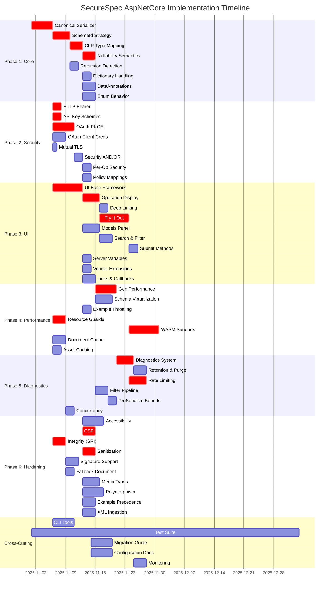

# Implementation Phase Roadmap



## Phase Dependencies Diagram

```mermaid
graph TD
    %% Phase 1 - Foundation
    P1_1[1.1 Canonical Serializer] --> P1_2[1.2 SchemaId Strategy]
    P1_2 --> P1_3[1.3 CLR Type Mapping]
    P1_3 --> P1_4[1.4 Nullability]
    P1_2 --> P1_5[1.5 Recursion Detection]
    P1_3 --> P1_6[1.6 Dictionary Handling]
    P1_3 --> P1_7[1.7 DataAnnotations]
    P1_3 --> P1_8[1.8 Enum Behavior]
    
    %% Phase 2 - Security
    P1_1 --> P2_1[2.1 HTTP Bearer]
    P1_1 --> P2_2[2.2 API Key]
    P1_1 --> P2_3[2.3 OAuth PKCE]
    P1_1 --> P2_4[2.4 OAuth Client]
    P1_1 --> P2_5[2.5 Mutual TLS]
    P2_1 & P2_2 & P2_3 & P2_4 & P2_5 --> P2_6[2.6 Security AND/OR]
    P2_6 --> P2_7[2.7 Per-Op Security]
    P2_6 --> P2_8[2.8 Policy Mappings]
    
    %% Phase 3 - UI
    P1_1 --> P3_1[3.1 UI Framework]
    P3_1 --> P3_2[3.2 Operation Display]
    P3_2 --> P3_3[3.3 Deep Linking]
    P3_2 --> P3_4[3.4 Try It Out]
    P3_1 --> P3_5[3.5 Models Panel]
    P3_2 --> P3_6[3.6 Search & Filter]
    P3_4 --> P3_7[3.7 Submit Methods]
    P3_1 --> P3_8[3.8 Server Variables]
    P3_1 --> P3_9[3.9 Vendor Extensions]
    P3_1 --> P3_10[3.10 Links & Callbacks]
    
    %% Phase 4 - Performance
    P1_8 --> P4_1[4.1 Gen Performance]
    P1_3 & P1_8 --> P4_2[4.2 Virtualization]
    P1_3 --> P4_3[4.3 Example Throttling]
    P1_1 --> P4_4[4.4 Resource Guards]
    P3_4 --> P4_5[4.5 WASM Sandbox]
    P1_1 --> P4_6[4.6 Document Cache]
    P1_1 --> P4_7[4.7 Asset Caching]
    
    %% Phase 5 - Diagnostics
    P4_5 --> P5_1[5.1 Diagnostics System]
    P5_1 --> P5_2[5.2 Retention & Purge]
    P3_4 --> P5_3[5.3 Rate Limiting]
    P1_3 & P1_7 --> P5_4[5.4 Filter Pipeline]
    P5_4 --> P5_5[5.5 PreSerialize Bounds]
    P4_6 & P5_4 --> P5_6[5.6 Concurrency]
    
    %% Phase 6 - Hardening
    P3_1 --> P6_1[6.1 Accessibility]
    P3_1 --> P6_2[6.2 CSP]
    P1_1 --> P6_3[6.3 Integrity SRI]
    P3_1 --> P6_4[6.4 Sanitization]
    P6_3 --> P6_5[6.5 Signature]
    P4_4 --> P6_6[6.6 Fallback Doc]
    P1_3 --> P6_7[6.7 Media Types]
    P1_3 --> P6_8[6.8 Polymorphism]
    P1_3 --> P6_9[6.9 Example Precedence]
    P1_3 --> P6_10[6.10 XML Ingestion]
    
    %% Cross-cutting
    P1_1 & P6_3 --> X1[X.1 CLI Tools]
    X2[X.2 Test Suite]
    P2_8 --> X3[X.3 Migration Guide]
    P2_8 --> X4[X.4 Config Docs]
    P5_1 & P5_3 & P4_5 --> X5[X.5 Monitoring]
    
    %% Styling
    classDef critical fill:#ff6b6b,stroke:#c92a2a,color:#fff
    classDef high fill:#ffd93d,stroke:#f59f00,color:#000
    classDef medium fill:#95e1d3,stroke:#20c997,color:#000
    classDef low fill:#d0ebff,stroke:#4dabf7,color:#000
    
    class P1_1,P1_2,P1_3,P1_4,P2_1,P2_2,P2_3,P3_1,P3_2,P3_4,P4_1,P4_4,P4_5,P5_1,P5_3,P6_2,P6_3,P6_4,X2 critical
    class P1_5,P1_6,P1_7,P1_8,P2_6,P2_7,P3_3,P3_5,P3_6,P4_2,P4_3,P4_6,P5_4,P5_5,P5_6,P6_1,P6_6,P6_7,P6_8,X1,X3,X4 high
    class P2_4,P2_8,P3_7,P3_8,P3_9,P4_7,P5_2,P6_9,P6_10,X5 medium
    class P2_5,P3_10,P6_5 low
```



## Critical Path Visualization

```
Week 1-2 (Phase 1: Foundation)
┌─────────────────────────────────────┐
│ 1.1 Serializer (CRITICAL)           │ ──┐
│ 1.2 SchemaId (CRITICAL)              │   │
│ 1.3 Type Mapping (CRITICAL)          │   ├─→ Enables all schema work
│ 1.4 Nullability (CRITICAL)           │   │
└─────────────────────────────────────┘ ──┘

Week 3-4 (Phase 2: Security)
┌─────────────────────────────────────┐
│ 2.1 Bearer (CRITICAL)                │ ──┐
│ 2.2 API Key (CRITICAL)               │   ├─→ Enables secure exploration
│ 2.3 OAuth PKCE (CRITICAL)            │   │
└─────────────────────────────────────┘ ──┘

Week 5-6 (Phase 3: UI)
┌─────────────────────────────────────┐
│ 3.1 UI Framework (CRITICAL)          │ ──┐
│ 3.2 Operations (CRITICAL)            │   ├─→ Enables user interaction
│ 3.4 Try It Out (CRITICAL)            │   │
└─────────────────────────────────────┘ ──┘

Week 7 (Phase 4: Performance)
┌─────────────────────────────────────┐
│ 4.5 WASM Sandbox (CRITICAL)          │ ──→ Security isolation
└─────────────────────────────────────┘

Week 9 (Phase 6: Hardening)
┌─────────────────────────────────────┐
│ 6.2 CSP (CRITICAL)                   │ ──┐
│ 6.3 Integrity (CRITICAL)             │   ├─→ Production ready
│ 6.4 Sanitization (CRITICAL)          │   │
└─────────────────────────────────────┘ ──┘
```

## Issue Count by Category

```
Security: ████████████████░░ 18 issues (33%)
Schema:   ████████████░░░░░░ 14 issues (26%)
UI:       ██████████░░░░░░░░ 10 issues (19%)
Perf:     ███████░░░░░░░░░░░  7 issues (13%)
Other:    █████░░░░░░░░░░░░░  5 issues (9%)
```

## Completion Tracking Template

```
□ Phase 1: Core (0/8)
  □ 1.1 Canonical Serializer
  □ 1.2 SchemaId Strategy
  □ 1.3 CLR Type Mapping
  □ 1.4 Nullability Semantics
  □ 1.5 Recursion Detection
  □ 1.6 Dictionary Handling
  □ 1.7 DataAnnotations
  □ 1.8 Enum Behavior

□ Phase 2: Security (0/8)
  □ 2.1 HTTP Bearer
  □ 2.2 API Key Schemes
  □ 2.3 OAuth PKCE
  □ 2.4 OAuth Client Credentials
  □ 2.5 Mutual TLS
  □ 2.6 Security AND/OR
  □ 2.7 Per-Op Security
  □ 2.8 Policy Mappings

□ Phase 3: UI (0/10)
  □ 3.1 UI Base Framework
  □ 3.2 Operation Display
  □ 3.3 Deep Linking
  □ 3.4 Try It Out
  □ 3.5 Models Panel
  □ 3.6 Search & Filter
  □ 3.7 Submit Methods
  □ 3.8 Server Variables
  □ 3.9 Vendor Extensions
  □ 3.10 Links & Callbacks

□ Phase 4: Performance (0/7)
  □ 4.1 Gen Performance
  □ 4.2 Virtualization
  □ 4.3 Example Throttling
  □ 4.4 Resource Guards
  □ 4.5 WASM Sandbox
  □ 4.6 Document Cache
  □ 4.7 Asset Caching

□ Phase 5: Diagnostics (0/6)
  □ 5.1 Diagnostics System
  □ 5.2 Retention & Purge
  □ 5.3 Rate Limiting
  □ 5.4 Filter Pipeline
  □ 5.5 PreSerialize Bounds
  □ 5.6 Concurrency

□ Phase 6: Hardening (0/10)
  □ 6.1 Accessibility
  □ 6.2 CSP
  □ 6.3 Integrity (SRI)
  □ 6.4 Sanitization
  □ 6.5 Signature Support
  □ 6.6 Fallback Document
  □ 6.7 Media Types
  □ 6.8 Polymorphism
  □ 6.9 Example Precedence
  □ 6.10 XML Ingestion

□ Cross-Cutting (0/5)
  □ X.1 CLI Tools
  □ X.2 Test Suite
  □ X.3 Migration Guide
  □ X.4 Config Docs
  □ X.5 Monitoring

Overall Progress: 0/54 (0%)
```

---

**Legend**:
- 🔴 Critical Priority
- 🟡 High Priority
- 🟢 Medium Priority
- 🔵 Low Priority
